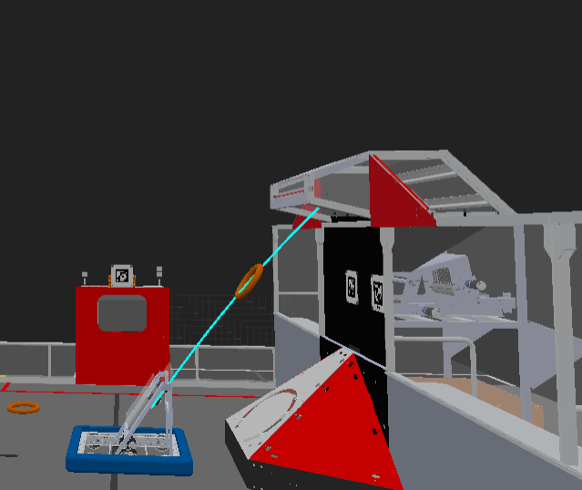

# Simulating GamePiece Projectiles
!!! warning

      You are reading the documentation for a Beta version of maple-sim. API references are subject to change in future versions.

---
## 0. Overview

Projectiles are game pieces launched into the air, typically from flywheels. In maple-sim, these game pieces are modeled using basic projectile motion with gravity only.

<div style="display: flex; justify-content: space-between;" markdown>
{width="49%"}
{width="49%"}

</div>

!!! tip
      This simulation is intended to test code logic for auto-aiming functions and measure the accuracy of your shooter optimization under simulated vision, drive, and flywheels.

      It **DOES NOT** replicate the projectile motion of a real game piece. You will need to use different constants for shooter optimization in the simulation and on the real robot.

---

## 1. Creating a GamePiece Projectile

The `GamePieceProjectile` is an abstract class representing any game piece that flies in the air. You will need to create an instance of this class.

Currently, the only subclass of `GamePieceProjectile` is `NoteOnFly`, which represents a Crescendo Note launched into the air.

```java
NoteOnFly noteOnFly = new NoteOnFly(
        // Specify the position of the chassis when the note is launched
        robotSimulationWorldPose.getTranslation(),
        // Specify the translation of the shooter from the robot center (in the shooter’s reference frame)
        new Translation2d(0.2, 0),
        // Specify the field-relative speed of the chassis, adding it to the initial velocity of the projectile
        chassisSpeedsFieldRelative,
        // The shooter facing direction is the same as the robot’s facing direction
        robotSimulationWorldPose.getRotation()
                // Add the shooter’s rotation
                + shooterRotation,
        // Initial height of the flying note
        0.45,
        // The launch speed is proportional to the RPM; assumed to be 16 meters/second at 6000 RPM
        velocityRPM / 6000 * 20,
        // The angle at which the note is launched
        Math.toRadians(55)
);
```

---
## 2. Configuring the GamePiece

### Configuring Target
You can configure the projectile to have a target. If the projectile is within a tolerance range near the target during its flight, it will hit the target, disappear, and trigger a callback.

This can be done through the following configuration:

```java
noteOnFly
        // Set the target center to the Crescendo Speaker of the current alliance
        .withTargetPosition(() -> FieldMirroringUtils.toCurrentAllianceTranslation(new Translation3d(0.25, 5.56, 2.3)))
        // Set the tolerance: x: ±0.5m, y: ±1.2m, z: ±0.3m (this is the size of the speaker's "mouth")
        .withTargetTolerance(new Translation3d(0.5, 1.2, 0.3))
        // Set a callback to run when the note hits the target
        .withHitTargetCallBack(() -> System.out.println("Hit speaker, +2 points!"));
```
For this specific season, you can use `asSpeakerShotNote(Runnable)` and `asAmpShotNote(Runnable)` from `NoteOnFly`.

```java
noteOnFly
        // Configure the Speaker (of the current alliance) as the target of the projectile
        .asSpeakerShotNote(() -> System.out.println("Hit speaker, +2 points!"));

```

```java
noteOnFly
        // Configure the Amp (of the current alliance) as the target of the projectile
        .asAmpShotNote(() -> System.out.println("Hit amp, +1 point!"));
```

### Visualizing Trajectory
```java
noteOnFly
        // Configure callbacks to visualize the flight trajectory of the projectile
        .withProjectileTrajectoryDisplayCallBack(
        // Callback for when the note will eventually hit the target (if configured)
        (pose3ds) -> Logger.recordOutput("Flywheel/NoteProjectileSuccessfulShot", pose3ds.toArray(Pose3d[]::new)),
        // Callback for when the note will eventually miss the target, or if no target is configured
        (pose3ds) -> Logger.recordOutput("Flywheel/NoteProjectileUnsuccessfulShot", pose3ds.toArray(Pose3d[]::new))
        );
```

!!! tip 
      On Advantage Scope, you can visualize the two trajectories with different colors (e.g., green and red) to see if the note missed the target.

### Becoming GamePieceOnFieldSimulation
In this simulation, a game piece launched into the air can be configured to become a `GamePieceOnFieldSimulation` upon touchdown.

When the projectile touches down, a `GamePieceOnFieldSimulation` will be added to the `SimulatedArena`, conserving the projectile’s air velocity.

```java
noteOnFly
        // Configure the note projectile to become a NoteOnField upon touching the ground
        .enableBecomeNoteOnFieldAfterTouchGround();
```

---
## 3. Launching the GamePiece

The projectile simulation is updated and visualized within the `SimulatedArena` instance.

To register the projectile, use:

```java
// Add the projectile to the simulated arena
SimulatedArena.getInstance().addGamePieceProjectile(noteOnFly);
```

The real-time positions of the flying game pieces are also visualized with other game pieces, as described [here](./using-the-simulated-arena.md#visualizing-game-pieces).

